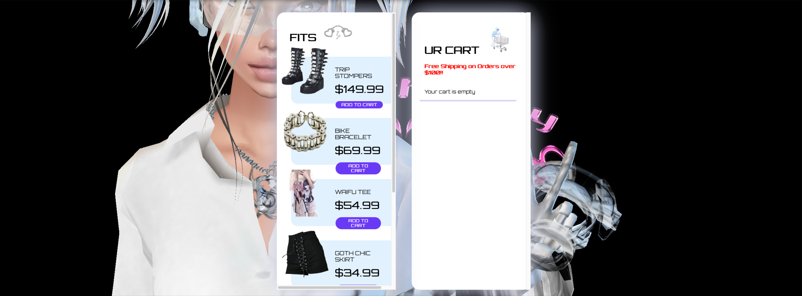
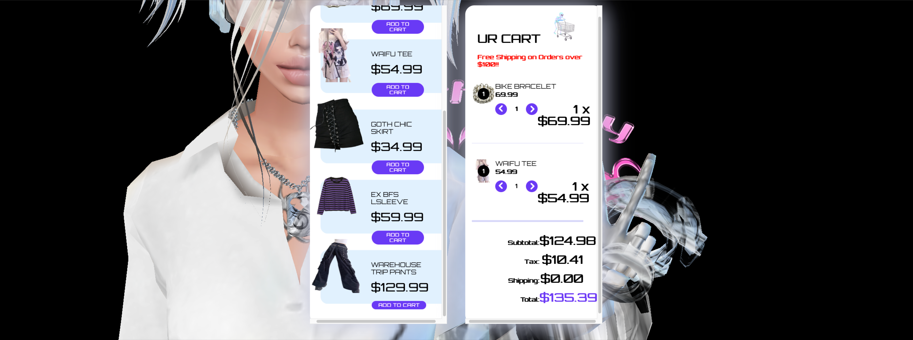

# grundge-ECOMM(made w/React)

## Description 
This was a fun project for me to whip up!! It really was testing of my knowledge with React Hooks which is why I wanted to do it.
But to get to the point this is an ECOMM shopping cart simulator. It is themed for edgy womans clothes//shoes :black_heart::kiss: which are very trendy at the moment, and pushed my boundaries since i haven't made anything centered around women yet :revolving_hearts:

Here is a screenshot of the app! :camera::camera::camera:

As well as the functionality ~free shipping for orders over 100~ ;) :100:

You can test out the app yourself with it's deployment link [here](https://jamestpatmore.github.io/grundge-ECOMM/)
:nail_care::nail_care::nail_care:

## Outro 
Thank You so Much for checking this out!!! 

Also to add...
I'd love to build on this in the future and make it more substantial by adding a backend as well as a full customer experience, but this took me a day and essentially was a speedrun//practice session.

:wave::wave::wave: